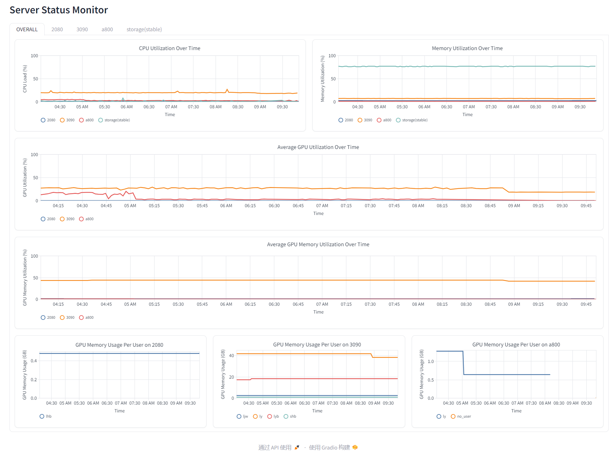
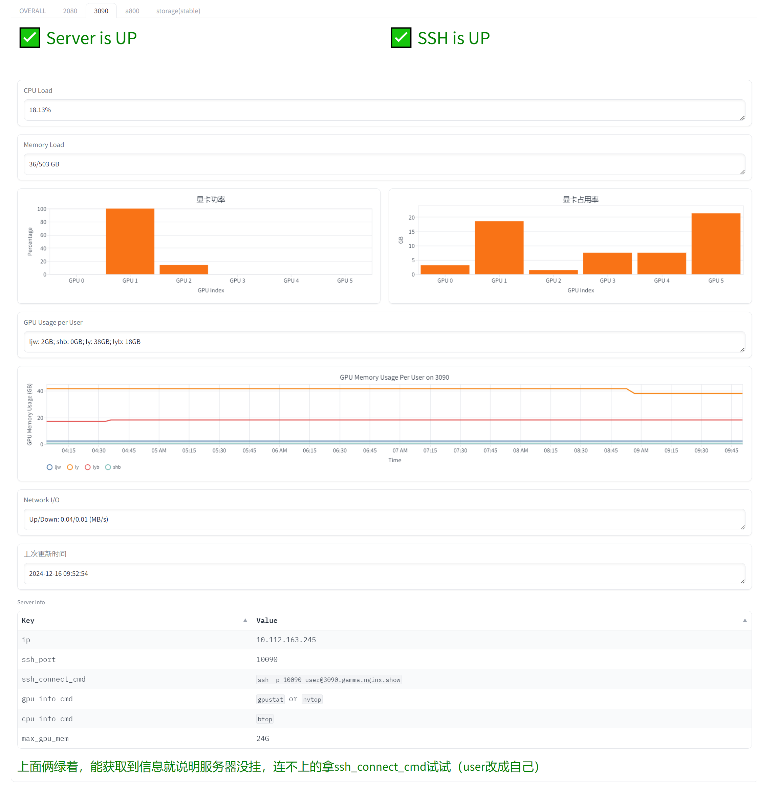
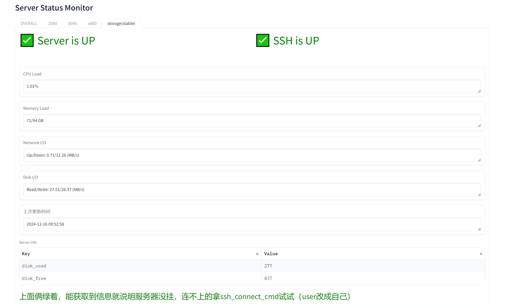
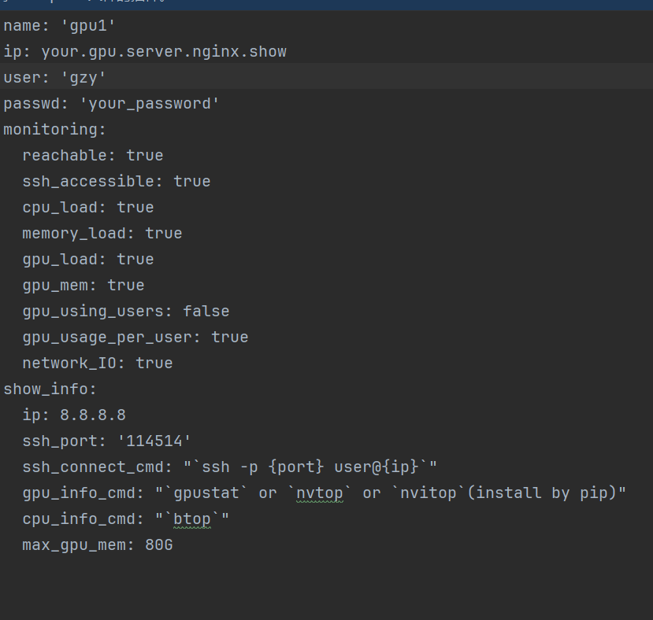

# Servers Monitor

a tools that can monitor servers status(include normal server like storage servers, but special in GPU servers ), and show them in a web page.

** btw,it can help a server manager to tell his users "See the green label, our servers are working well, you failed to login because of your own network problem, don't ask me again!". **

overall page like:

 
and for each server(has gpu), page like:

if server doesn't have gpu, the gpu part will not show, page will be like:

For these missing parts, you can actually set whether to display them by editing the configuration file.

(but the monitor will collect them anyway, so you can use them in the future)

## params

will add more in future

## structure

### folder
config: the configuration file, you can set the server list, and params for each server (must be set for each server)

logs: the log file, you can check the log to see what happened(not implemented well)

status: the status file, also be the data file, you can check the status of each server, and the monitor will update it every 10 s
(In fact, while the monitor is writing to the file, the gradio program used for visualization is reading at the same time.)

### python file
just like these name :D

